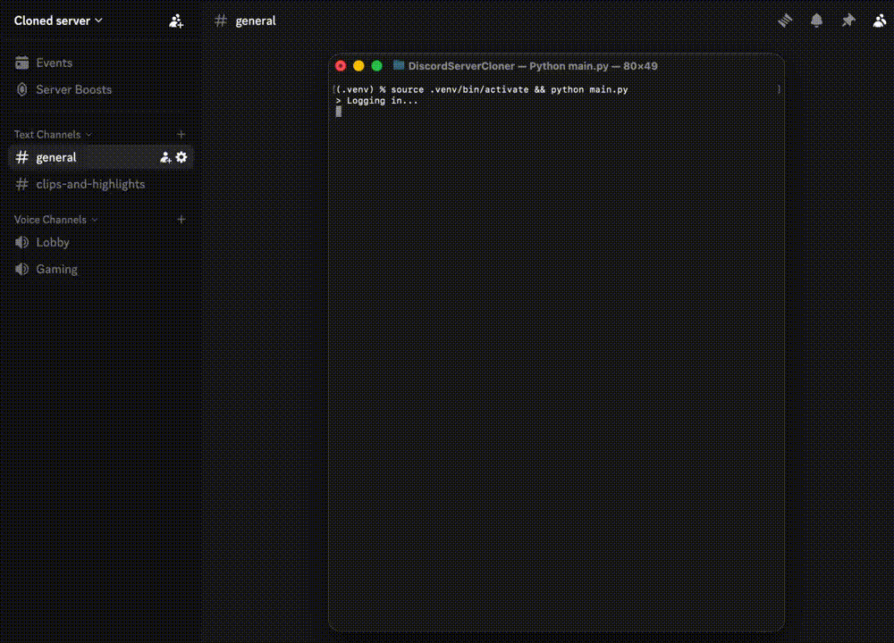

<h1 align="center">
  Discord Server Cloner 🚀
</h1>

<p align="center">
  
  
  
  
</p>


## 🔥・Features
```
✔ Customizable speed
✔ Easy to use
✔ Safe to use (with default settings)
```

```
✔ Clone Channels
✔ Clone Roles
✔ Clone Emojis
✔ Clone Server Settings
```
---


## 🚀・Setup

```
> Download zip file
> pip install -r requirements.txt 
> Run main.py
```

## 📄・License

This project is licensed under the GPL General Public License v3.0 License
```
- Educational purpose only and all your consequences caused by you actions is your responsibility
- Selling this Free Tool is forbidden
- If you make a copy of this/or fork it, it must be open-source and have credits linking to this repo
```

<p align="center">
  README inspired from xKiian
</p>
 